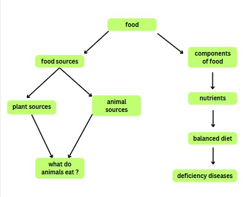

## Content Type 

As part of our implementation, we primarily focused on gathering both textual and video-based educational content relevant to the chapters. The collected resources were carefully reviewed and curated from platforms such as YouTube, Khan Academy and others. After collection, the materials were further edited and customized to align with our specific learning objectives. This included organizing the content into topic-wise segments—such as sources of food, components of food, nutrients, balanced diet, and deficiency diseases—for better clarity, accessibility, and structured learning.

## Content Resources

The resources listed were curated from various online lectures and educational websites, based on the Grade 6 CBSE NCERT chapters "Food: Where Does It Come From?" and "Components of Food."

Shown below is the topic wise breakup we followed for our implementation and their corresponding resources.

### Food Introduction

| File Type | Link | Website  |
|-----------|------|--------------|
| video | https://www.youtube.com/watch?v=qhbdqKUwk0w | Khan Academy |
| text | https://byjus.com/cbse-notes/cbse-class-6-science-notes-chapter-1-food-where-does-it-come-from/ | BYJU'S |
| text | https://www.nextgurukul.in/wiki/concept/cbse/class-6/science/food-where-does-it-come-from/sources-of-food/3957756 | NextGurukul |
| text | https://www.vedantu.com/biology/food-source | Vedantu |

### Food Sources

| File Type | Link | Website  |
|-----------|------|--------------|
| video | https://www.youtube.com/watch?v=cmupZ8DuB3I | Khan Academy |
| text | https://byjus.com/cbse/food-variety-and-sources/ | BYJU'S |
| text | https://byjus.com/biology/food-sources-animal-plant-products/ | BYJU'S |

### Components of Food

| File Type | Link | Website  |
|-----------|------|--------------|
| text | https://byjus.com/cbse/components-of-food/ | BYJU'S |
| text | https://www.vedantu.com/biology/components-of-food | Vedantu |

### Nutrients

| File Type | Link | Website  |
|-----------|------|--------------|
| video | https://www.youtube.com/watch?v=AKKnhhFO50k | YouTube |
| video | https://www.youtube.com/watch?v=44MsQw8VjEs&t=8s | Khan Academy |
| text | https://byjus.com/biology/nutrients/ | BYJU'S |

### Balanced Diet

| File Type | Link | Website  |
|-----------|------|--------------|
| video | https://www.youtube.com/watch?v=wi59b8fX0AE | YouTube |
| text | https://classnotes.org.in/class-6/science/components-of-food/balanced-diet/ | ClassNotes |

### Deficiency Diseases

| File Type | Link | Website  |
|-----------|------|--------------|
| video | https://www.youtube.com/watch?v=d0aUIesWWB8 | Khan Academy |
| text | https://byjus.com/biology/food-deficiency/ | BYJU'S |
| text | https://www.vedantu.com/biology/food-deficiency | Vedantu |

### Plant-based sources

| File Type | Link | Website  |
|-----------|------|--------------|
| video | https://www.youtube.com/watch?v=e0kkwDxQJRs&t=236s | Khan Academy |

### Animal-based sources

| File Type | Link | Website  |
|-----------|------|--------------|
| text | https://byjus.com/biology/food-sources-animal-plant-products/ | BYJU'S |

### What Do Animals Eat?

| File Type | Link | Website  |
|-----------|------|--------------|
| video | https://www.youtube.com/watch?v=Lp7VBh2gx38 | YouTube |
| text | https://byjus.com/biology/carnivores-herbivores/ | BYJU'S |
| text | https://byjus.com/cbse-notes/cbse-class-6-science-notes-chapter-1-food-where-does-it-come-from/#what-do-animals-eat | BYJU'S |

### Entire Chapter References

| File Type | Link | Website  |
|-----------|------|--------------|
| text | https://www.extramarks.com/studymaterials/cbse/cbse-class-6-science-revision-notes-chapter-1/ | Extramarks |
| text | https://www.learncbse.in/food-come-cbse-notes-class-6-science/ | LearnCBSE |
| text | https://www.nextgurukul.in/wiki/resources/cbse/class-6/science/food-where-does-it-come-from/6001274 | NextGurukul |
| text | https://www.nextgurukul.in/wiki/resources/cbse/class-6/science/components-of-food/6001678 | NextGurukul |
| text | https://allen.in/cbse-notes/class-6-science-notes-chapter-1-components-of-food | Allen |
| text | https://www.pw.live/chapter-components-of-food | PhysicsWallah |
| text | https://www.learncbse.in/components-food-cbse-notes-class-6-science/ | LearnCBSE |
| video | https://www.youtube.com/watch?v=MYUU8ZcGGt8 | YouTube |
| video | https://www.youtube.com/watch?v=rJw4RpFRhBo | YouTube |
| video | https://www.youtube.com/watch?v=Qt7ZCc4JlzA | YouTube |
| video | https://www.youtube.com/watch?v=7YPp4eMf6lQ | YouTube |
