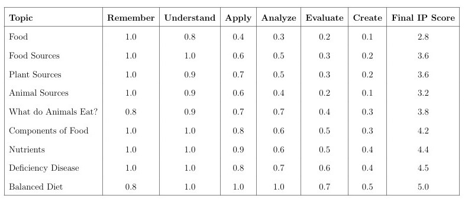
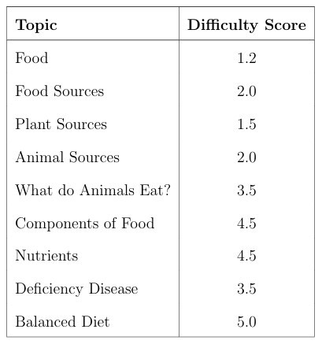

## Readability

 To evaluate the readability for textual content, the [Flesch-Kincaid Readability Calculator](https://serpninja.io/tools/flesch-kincaid-calculator/#:~:text=The%20Flesch%20Reading%20Ease%20Score%20ranges%20from%200%20to%20100,complex%20and%20difficult%20to%20understand) was employed, an online tool designed to assess how easy a passage
 is to read. 
 For the video content, the text from the videos was extracted using online transcribers such as [turboscribe](https://turboscribe.ai/dashboard) & [vizard](https://vizard.ai/tools/video-to-text). The output text was then manually verified to ensure correctness. The verified text was then fed to the same readability score calculator to get the final readability score.

 ##  Learning Style Scores

 For video content, the VAT(visual-auditory-textual) score was derived by individually analyzing visual, audio, and textual elements.

 To assess the visual component of the videos, a combination of MoviePy, OpenCV, and a pretrained ResNet-18 model was employed. Frames were sampled at regular intervals across the video using MoviePy to ensure representative visual content is being considered. OpenCV, widely used for computer vision tasks, facilitated efficient frame extraction and enabled detailed analysis of motion intensity, shot transitions, brightness, and color richness—key indicators of visual engagement. In parallel, each extracted frame was passed through a pretrained ResNet-18 convolutional neural network, which produced a confidence score indicating the model’s ability to classify the frame’s visual content accurately. These confidence scores were averaged across all sampled frames to derive a quantitative measure of the video’s visual interpretability. This combined approach provided insights into the clarity of the video content.

 To evaluate the auditory aspect of the video content, an audio intensity score was computed based on the Root Mean Square (RMS) energy, a widely accepted metric for measuring perceived loudness. The audio track was first extracted from the video using the MoviePy library. Subsequently, the audio waveform was processed using Librosa, a Python library for audio and music analysis. Librosa was used to calculate the RMS energy across short, evenly spaced segments of the audio. It reflects the overall energy and richness of the video’s auditory component and serves as a quantitative indicator of how dynamically engaging the audio content is throughout the video. 

 To approximate the textual richness of video content, a lightweight proxy-based approach was used, leveraging the video’s frame rate (frames per second, or FPS) as an indirect indicator of slide or text density. The frame rate was calculated by dividing the total number of frames by the video’s duration. A higher FPS suggests more frequent visual updates, which can correlate with content-rich presentations such as lecture slides or informationheavy visuals. While this method does not perform direct text extraction, it provides a practical and scalable estimate of the video’s textual density. 

  For textual materials, since they inherently lack visual and audio elements, the VAT score was simplified to focus solely on the textual component.

 The code used to obtain the above mentioned scores can be found in this [Google Colab link](https://colab.research.google.com/drive/1BdgXUKkcZOr4lNWe47X1uH4vx1GpoEMa#scrollTo=mhzPcadZl9V7).

 ## Information Processing

To evaluate a student’s information processing ability for each Class 6 Science topic, we use Bloom’s Taxonomy. Bloom’s taxonomy categorizes cognitive skills into six levels: Remember, Understand, Apply, Analyze, Evaluate, and Create. Each level reflects a deeper or more complex understanding. For each topic,we assign a score between 0 and 1 at each level based on how well the topic allows or encourages students to engage with that cognitive skill.

The table below shows the ip scores assigned to each topic.

## AverageDifficulty
 For assigning average difficulty values for the topics, we approached grade 6 science teachers to get their general consensus.With their results we assigned the difficulty scores for each topic.

 The table below shows the difficulty scores assigned to each topic.
